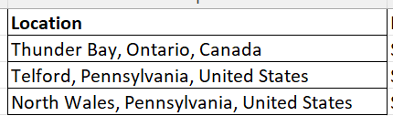
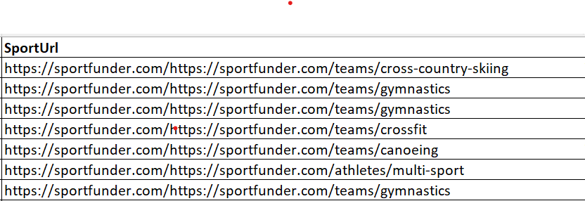
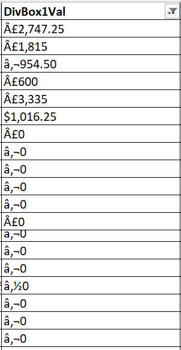
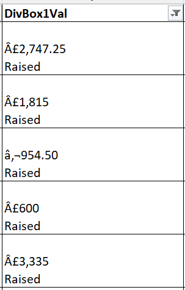
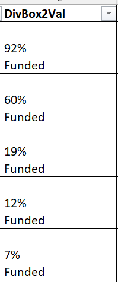
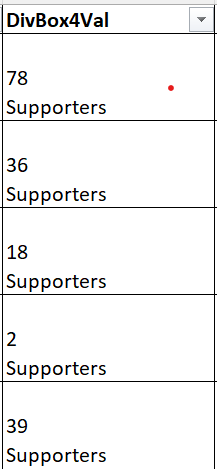
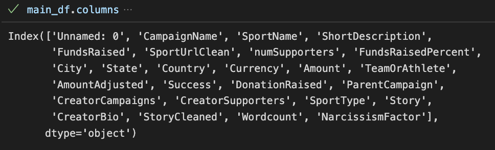

[](https://classroom.github.com/a/qhaxyQhs)
# Analysis of Sports Crowdfunding Campaigns

## Executive Summary

Our analysis of sports crowdfunding campaigns reveals that of the 1,143 campaigns in the sample, only 5.8% were successful, indicating that it is very hard to compete for funds in the sports crowdfunding market. A few exceptions are present for the rule with funds raised more than 200% than their funding goals. United States and Canada lead the pack among the geographical distribution with over 50% campaigns from these two countries. We see that factors such as individual or team type campaign, state, country, etc. affect the crowdfunding outcomes. We also observe that the sports crowdfunding is highly concentrated in the team-based sports rather than individual sports. All these insights can lead into a predictive model which can be used to predict crowdfunding outcomes.

#### Idea
Analysis of reward-based sports crowdfunding campaigns from the SportFunder website, aimed at supporting the entrepreneurs, crowdfunders, and investors, through consulting<br>
#### Business Opportunity
We aim to develop a business model with the sports campaign creators (individuals and small businesses) as our primary customers, whom we aim to offer consulting services on developing successful campaigns. The success framework that we develop through an empirical analysis of the crowdfunding data of sports campaigns will serve as the backbone of our services. The services will primarily include:
* Defining the structure and launch plan of the crowdfunding campaign – funding goal, campaign duration, rewards and reward tiers
* Providing personalized feedback on the storytelling approach and text used in the campaign. Also guide the creators on videos and images
* Support the creators on marketing and PR activity – primarily, utilization of social media and other channels for campaign promotion

#### Importance
* Crowdfunding, formally defined as “a method of collecting small contribu­tions through an online funding platform or site from a large number of funders” (Li & Huang, 2020, p. 85) has emerged as major source of financing for individual creators and businesses alike, with ~ $13.5 billion market size in 2021, which is expected to grow to ~$28.2 billion by 2028 (Globe NewsWire, 2022). Not only has the crowdfunding topic been of academic research interest with over 140 manuscripts published in the last decade – Appendix A, but it has led to development of novel business models primarily aimed at supporting the campaign creators. For instance, the largest rewards-based crowdfunding platform Kickstarter offers the Experts service with the aim that they can leverage their data and experience in working with successful crowdfunding campaigns to the benefit of new creators (Kickstarter, n.d.).
* Interestingly, factors affecting rewards-based crowdfunding outcomes are not consistent across sectors or industries, hence disparate research exists on the analysis of crowdfunding success – such as in music (e.g., Mendes-Da-Silva et al., 2016), restaurants (e.g., Kedas & Sarkar, 2022), theatre (e.g., Frydrych et al., 2014), among many others. We particularly aim to look at sports crowdfunding, as it is a growing niche, with increasing interest from both academicians and practitioners, and our work might push the current state of knowledge in the sports crowdfunding area and potentially pave way for a new business. 
* Narcissism has been shown to play a major role in determining if entrepreneurs succeed in attracting funds for their crowdfunded ventures (Anglin et al., 2018). Based on the insights of their study, we also aim to see if narcissism plays a significant role in Sports Crowdfunding. 

#### Sources (Citations)
* Anglin, A. H., Wolfe, M. T., Short, J. C., McKenny, A. F., & Pidduck, R. J. (2018). Narcissistic rhetoric and crowdfunding performance: A social role theory perspective. Journal of Business Venturing, 33(6), 780-812.
* Frydrych, D., Bock, A. J., Kinder, T., & Koeck, B. (2014). Exploring entrepreneurial legitimacy in reward-based crowdfunding. Venture capital, 16(3), 247-269.
* Globe Newswire, (April 12, 2022). “Demand for Global Crowdfunding Market Size & Share to Surpass USD 28.2 Billion by 2028, Exhibit a CAGR of 11.8% | Industry Trends, Status, Revenue, Opportunities, Segmentation Analysis & Forecast Report by Facts & Factors”, Globe Newswire, Retrieved from https://www.globenewswire.com/news-release/2022/04/12/2420860/0/en/Demand-for-Global-Crowdfunding-Market-Size-Share-to-Surpass-USD-28-2-Billion-by-2028-Exhibit-a-CAGR-of-11-8-Industry-Trends-Status-Revenue-Opportunities-Segmentation-Analysis-Forec.html 
* Kedas, S., & Sarkar, S. (2022). Putting your money where your mouth is–the role of rewards in a value-based understanding of restaurant crowdfunding. International Journal of Contemporary Hospitality Management, (ahead-of-print).
* Kickstarter, (n.d.). “Kickstarter Experts”, Retrieved from https://www.kickstarter.com/experts
* Li, M., & Huang, Y. (2020). Crowdfunding in sport management. In Managing Sport Across Borders (pp. 83-100). Routledge.
* Mendes-Da-Silva, W., Rossoni, L., Conte, B. S., Gattaz, C. C., & Francisco, E. R. (2016). The impacts of fundraising periods and geographic distance on financing music production via crowdfunding in Brazil. Journal of Cultural Economics, 40(1), 75-99.


## Statement of Scope
The goal of the project is to identify the factors that affect the success or failure of a sports crowdfunding campaign. The secondary goal is to study the effects of narcissistic rhetoric on crowdfunding performance in sports crowdfunding. We look at the role the different dimensions of narcissism play in the funding performance.

 The insights from the study would be beneficial for entrepreneurs and academicians in the sports crowdfunding field. If we can successfully develop or implement a tool derived to enable creators of sports crowdfunding campaigns to analyse their campaign and finetune it as per the different factors identified for success, we can market the tool as a potential business solution.

A) Project Objectives

1.  To scrape the data on crowdfunding campaigns from the sports crowdfunder website **Sportfunder** 
2. Clean and store the data in a machine readable format
3.  Conduct an exploratory analysis to identify the factors that might affect the crowdfunding outcomes - binary outcome (success or failure) and funding received as a percent of funding goal (\%) 
4.  Explore the variation in crowdfunding outcomes and percent of funding goal raised with respect to various factors such as country, state, type of campaign, sport etc.

Unit of Analysis: In our analysis, we have looked at two primary units of analysis - the crowdfunding campaign and associated with it  - the crowdfunding outcome, captured by a binary variable __Success__ (Success = 1, Failure = 0) and the extent to which the crowdfunding campaing succeeded or failed, be captured by a continuous variable __Funds Received Pct__ (% of funding goal achieved). For ex., a successful crowdfunding campaign might have received $ 4000 for a funding goal of $ 2000, this indicates that for that crowdfunding campaign __Success__ = 1 and __Funds Received Pct__ = 4000/2000 * 100 = 200%

## Project Schedule

Since the project is a part of the 'Programming for data science and analytics 1' course and is scheduled within course timeline, the duration and deadlines were known beforehand. This helped us in generating and following a smooth process flow in order to conduct the research in effective manner<br>
Team members with area of primary involvement:<br>
1) Ashutosh Maharana - Data cleaning and consolidation, Data visualization<br>
2) Rishitha Koneru - Data Transformation, Data Analysis
3) Satishwar Kedas - Project idea and proposal, Data scraping and transformation, Data Reduction<br>
4) Tharun Ponnaganti - Data cleaning and consolidation, Data Analysis<br>
5) Yash Patel - Data scraping and report preperation<br>

The image provided below shows the schedule of the project


In early days of the project, we focused on discussing different project ideas and after finalizing one idea we submitted project proposal. After that, the website https://sportfunder.com was analysed and plan for scraping was formatted. Team members Satishwar Kedas and Yash Patel worked together on finalizing scraping plan and co-ordinated with each other to scrap data from home page and individual campaign pages. Team members Ashutosh Maharana and Tharun Ponnaganti worked on Data Cleaning and consolidation and generated final data table for further analysis. After the initial project submission with final data set, we worked on data visualization and data analysis<br>


## Data Preparation
##### Summary

The diagram, which is presented below, shows step by step process utilized to generate final data which was used in visualization and further analysis


---
In order to understand the performance of crowdfunding campaigns, the data was scraped from website https://sportfunder.com<br>
* The website homepage shows cards for all campaigns with some basic info like date, expected and raised funds, supporters
* Clicking each campaign card opens up more details about specific campaign providing detailed descriptions
So, for each campaign some data was scraped from main page of website and further details were scraped from individual campaign page<br>

Key Files - Codes, Datasets
---
Codes
* [main.py](/code/main.py) is the Python file used to scrape the data from main page of the website https://sportfunder.com
* [campaign.py](/code/campaign.py) is the Python file used to scrape more details of each campaign after going into individual campaign pages
* [data_cleaning.py](/code/data_cleaning.py) is the Python file used for cleaning and transformation of scraped data and analysis of missing values
* [exploratory_data_analysis.py](/code/exploratory_data_analysis.py) is the Python file used for generating visualizations and analyzing final data
* [narcissism.py](/code/narcissism.py) is the Python file used for cleaning the text of the campaign stories and generating the raw word count scores for narcissism dimensions
* [data_consolidation.py](/code/data_consolidation.py) is the Python file used for merging multiple dataframes, dropping columns with missing values, generating final narcissism word counts
* [factor_analys.R](/code/factor_analysis.R) is the R file used for data reduction - factor analysis of narcissism word counts


---
Data tables and Data dictionary
* [main_data_clean.csv](/data/clean_data/main_data_clean.csv) contains the final data set generated after scraping and cleaning, and this data set was used for the analysis
* [DataDictionary.csv](/data/clean_data/DataDictionary.csv) is the data dictionary of final dataset
Raw data (uncleaned)
* [raw_data_main.csv](/data/raw_data/raw_data_main.csv) contains raw (uncleaned) data which was scraped from website https://sportfunder.com
* [raw_data_campaigns.csv](/data/raw_data/raw_data_campaigns.csv) contains raw (uncleaned) data which was scraped from website https://sportfunder.com
* [final_data_merged.csv](/data/clean_data/final_data_merged.csv) contains merged data from the two main raw data files - main and campaigns
* [final_data_merged_storycleaned.csv](/data/clean_data/final_data_merged_storycleaned.csv.csv) contains the cleaned story texts - removing noise, special characters, alphanumeric phrases etc.
* [final_data_merged_storycleaned_wordcounts.csv](/data/clean_data/final_data_merged_storycleaned_wordcounts.csv) contains the data coming from the narcissism.py as well as the original data - the wordcounts across each narcissism dimensions
* [final_dataset_analysis.csv](/data/clean_data/final_dataset_analysis.csv) is the final dataset with multiple columns dropped as per the % of missing values, 

---


### Data Access

#### Using Selenium driver to access Sportfunder

Selenium webdriver with Chrome browser was used to access and scrape data from crowdfunder.com. Window size was set to 1920 X 1080 pixel to enhannce scraping capabilities of the webdriver. After accessing each URl a sleep/hold of 5 seconds was added to  allow the ull webpage to load.

```Python
driver_path = "C:\chromedriver\chromedriver.exe"
driver = webdriver.Chrome(driver_path)
driver.set_window_position(0,0)
driver.set_window_size(1920,1080)

sportfunder_url = "https://sportfunder.com/"
driver.get(sportfunder_url)

time.sleep(5)

```

#### Identifying the key metadata and corresponding xpaths

Key descriptors such as campaign name, sport type, campaigner's name etc. of each campaign were identified from the all campaigns webpage. Xpaths for each of the key descriptors were identiefied and later used to scarpe respective descriptors. Sample code for some of the key descriptors and theor xpaths are shown below.

```Python

         
campaign_name = driver.find_element(By.XPATH, "/html/body/div[1]/section/div[1]/div[1]/div[2]/div[{}]/div[{}]/div/div[1]/a/h5".format(row_iter, column_iter)).text
            

```
| Descriptor Name | XPATH | 
|:---|:---|
| Campaign Name | /html/body/div[1]/section/div[1]/div[1]/div[2]/div[{}]/div[{}]/div/div[1]/a/h5 |
| Campaign URL | /html/body/div[1]/section/div[1]/div[1]/div[2]/div[{}]/div[{}]/div/div[1]/a |
| Campaign Pic | /html/body/div[1]/section/div[1]/div[1]/div[2]/div[{}]/div[{}]/div/a[1]/div |
| Profile Pic | /html/body/div[1]/section/div[1]/div[1]/div[2]/div[{}]/div[{}]/div/a[2]/div |
| Sport | /html/body/div[1]/section/div[1]/div[1]/div[2]/div[{}]/div[{}]/div/div[3]/a |
| Sport URL | /html/body/div[1]/section/div[1]/div[1]/div[2]/div[{}]/div[{}]/div/div[3]/a |
| Short Description | /html/body/div[1]/section/div[1]/div[1]/div[2]/div[{}]/div[{}]/div/p |
| Location | /html/body/div[1]/section/div[1]/div[1]/div[2]/div[{}]/div[{}]/div/div[2] |

<br>


### Data Scraping

#### Iterative data scraping

In the sportsfunding website, campaigns are arranged in 3 columns and 2 rows. To load more campaigns, "load more" button must be clicked. Using Xpaths, each of the campaign tiles were idendified and key descriptors were scraped. Once all 6 campaigns in the page were scraped, we leveraged the xpath of "load more"  button and a flag variable to make the scrapping iterative and smooth. A hold of 5 secs was added to load the full page before next iteration of scrapping begins. Please find below sample code for the process. 
```Python

           while row_iter < 100000:
    
    # check if iter div is present, if not load more
    try:
        print(row_iter)
        driver.find_element(By.XPATH, "/html/body/div[1]/section/div[1]/div[1]/div[2]/div[{}]/div[1]/div/div[1]/a/h5".format(row_iter))
        print("click worked")
        load_more_flag = 0
    except:
        load_more_flag = 1
    
    # each row has 3 campaigns
    # control flow for load more    
    if load_more_flag == 1 :
        driver.find_element(By.XPATH, loadmore_xpath).click()
        print("loaded more data")
        # row_iter += 1
        time.sleep(5)
    else: 
        for column_iter in range(1,4):
            sleep(1)
            try:
                campaign_name = driver.find_element(By.XPATH, "/html/body/div[1]/section/div[1]/div[1]/div[2]/div[{}]/div[{}]/div/div[1]/a/h5".format(row_iter, column_iter)).text
            except:
                campaign_name = "NULL"
```
#### Dealing with issues

In some of the campaigns, key descriptors were absent. To accomodate the missing descriptors and ensure continous iteration try and except block were added for each of the decriptors while assigning Xpaths in the code.
```Python

try:
                campaign_name = driver.find_element(By.XPATH, "/html/body/div[1]/section/div[1]/div[1]/div[2]/div[{}]/div[{}]/div/div[1]/a/h5".format(row_iter, column_iter)).text
            except:
                campaign_name = "NULL"
```

#### Data storing in csv files

After all required data was scraped and webdriver was stopped, all key descriptors ere stored in a dataframe as variables. This raw data was saved to a csv file named [Raw_Data](/data/raw_data/raw_main_363_378.csv) under data/raw_data folder.  


```Python

data = {'CampaignName': campaign_name_list, 'CampaignUrl': campaign_url_list, 'CampaignPicUrl': campaign_pic_url_list, 'ProfilePicUrl': profile_pic_url_list, 
                'SportName': sport_list, 'SportUrl': sport_url_list, 'ShortDescription': short_desc_list, 'Location': location_list, 
                'DivBox1Val': div_box_1_val_list, 'DivBox1Name': div_box_1_name_list, 'DivBox2Val': div_box_2_val_list, 'DivBox2Name': div_box_2_name_list,
                'DivBox3Val': div_box_3_val_list, 'DivBox3Name': div_box_3_name_list, 'DivBox4Val': div_box_4_val_list, 'DivBox4Name': div_box_4_name_list}
df = pd.DataFrame.from_dict(data)
df.to_csv("c:\\Users\\Satishwar Kedas\\OneDrive - Oklahoma A and M System\\Documents\\GitHub\\project-deliverable-2-invincible\\data\\raw_data\\raw_data_main.csv")

```

#### 

### Data Cleaning

1. Removing the redundant text from "campaign urls"
--- 
* The data we have before the cleaning was : "https://sportfunder.com/https://sportfunder.com/scotthill/7894"
* The data we have after cleaning : "https://sportfunder.com/scotthill/7894"
---
```python
     def clean_campaignurl(row):
	 campaignurl_unclean = str(row['CampaignUrl'])
	 campaignurl_clean = campaignurl_unclean.removeprefix('https://sportfunder.com/')
	 return campaignurl_clean
```

2. Removing the redundant text from "CampaignPicUrl" 
---
* The data we have before the cleaning was : "background-image: url("https://www.filepicker.io/api/file/YGfT1eD7RHigkfCWluTp/convert?w=400");"
* The data we have after cleaning : "https://www.filepicker.io/api/file/YGfT1eD7RHigkfCWluTp/convert?w=400"
---

```python

    def clean_campaignpicurl(row):
    cppicurl_unclean = str(row['CampaignPicUrl'])
    cppicurl_clean = cppicurl_unclean.removeprefix('background-image: url("')
    cppicurl_clean_1 = cppicurl_clean.removesuffix("\");")
    return cppicurl_clean_1
```

3. Removing the redundant text from "ProfilePicUrl" 
---
* The data we have before the cleaning was : 
"background-image: url("background-image: url("https://www.filepicker.io/api/file/VfCCtqcvR3KD1O1bFSv6/convert?w=400");"
* The data we have after cleaning : "https://www.filepicker.io/api/file/YGfT1eD7RHigkfCWluTp/convert?w=400"
---

```python

    def clean_campaignpicurl(row):
    cppicurl_unclean = str(row['CampaignPicUrl'])
    cppicurl_clean = cppicurl_unclean.removeprefix('background-image: url("')
    cppicurl_clean_1 = cppicurl_clean.removesuffix("\");")
    return cppicurl_clean_1
```

4. Removing the redundant text from "SportUrl"
--- 
* The data we have before the cleaning was : "https://sportfunder.com/https://sportfunder.com/teams/cross-country-skiing"
* The data we have after cleaning : "https://sportfunder.com/teams/cross-country-skiing"
---
```python 
    def clean_sporturl(row):
    sporturl_unclean = str(row['SportUrl'])
    sporturl_clean = sporturl_unclean.removeprefix('https://sportfunder.com/')
    return sporturl_clean
```
5. Treating Missing Values
--- 
* Python library "missingno" was used to visualize missing values in each column in final merged datafarme. Varibales with total percentage of missing values are listed as below.
* SportName(1.84%), ShortDescrption(0.017%), numSupporters(0.03%), City(8.04%), State(17%), Country(28.7%), TeamOrAthlete(1.84%), DonationsRaised(18.3%), ParentCampaign(93.7%), CreatorCampaigns(18.3%), CreatorSupporters(53%), SportType(19.7%), Story(18.7%) and CreatorBio(100%) columns had missing values. 

<p align="center">
    
</p> 

* Out of thise ParentCampaign, CreatorSupporters and CreatorBio columns are dropped from dataframe for further analysis, since these columns had more than 50% missing values and may impact model fit and output.

6. Analysing Distributions and Detecting outliers
--- 
* To analyze distributions and detecting potential outliers in numeric variables, QQ plots, histograms and boxplots were used.

<p align="center">
    
</p> 

* Downward bow shaped QQ plots show that numSupporters, FundsRaisedPercent, AmountAdjusted, Wordcount and NarcissismFactor variables may be heavily right skewed.
<p align="center">
    
</p>

* Respective histograms of above mentioned variables confirm that numeric variables are heavily right skewed. For modelling porposes, log transformation is needed for each of these variables. 
<p align="center">
    
</p> 

* After log transformations the distributions of numerical variables have become more appropriate for modelling purposes as seen in the above boxplots. There are some potential outliers in Wordcount variables which are out of interquartile range and these potential outliers need to be analyzed further. For modelling purposes records contaning these outlies need to be discarded from further analysis and modelling for bteer model fit and predictions. 


### Data Transformation

1. Transformation the location to City, State, Country

--- 
* The data we have before the cleaning was : "Thunder Bay, Ontario, Canada"

<p align="center">
    
</p>

* The data we have after cleaning : City- "Thunder Bay", State- "Ontario", Country- "Canada"
---
```python 
    df_clean[['City', 'State', 'Country']] = df_clean['Location'].str.split(pat= ", ", expand= True)
```


2. Identifying Team or Athelete from Sport URL
-- 
* The data we have before the cleaning was : "https://sportfunder.com/https://sportfunder.com/teams/cross-country-skiing"

<p align="center">
    
</p>

* The data we have after cleaning : City- "teams"
---
```python 
    def clean_sporturl(row):
    sporturl_unclean = str(row['SportUrl'])
    sporturl_clean = sporturl_unclean.removeprefix('https://sportfunder.com/https://sportfunder.com/')
    sporturl_clean_final = sporturl_clean.split("/", 1)[0]
    return sporturl_clean_final
    
```


3. Differentiating the currency
-- 
* The data we have before the cleaning was : "€9,301", "£2,747.25", "¥0","₽0","$5"

<p align="center">
    
</p>

* The data we have after cleaning : City- "Euro", "Pound", "Yen", "Russian Rubel", "USD"
---
```python 
df_clean['Currency'] = df_clean['Money Raised'].str[0]
df_clean['Amount'] = df_clean['Money Raised'].str[1:]
df_clean['Currency'] = np.where(df_clean['Currency'] == '$', 'USD', df_clean['Currency'])
df_clean['Currency'] = np.where(df_clean['Currency'] == '¥', 'Japanese Yen', df_clean['Currency'])
df_clean['Currency'] = np.where(df_clean['Currency'] == '£', 'Pound', df_clean['Currency'])
df_clean['Currency'] = np.where(df_clean['Currency'] == '₽', 'Russian Rubel', df_clean['Currency'])
df_clean['Currency'] = np.where(df_clean['Currency'] == '€', 'Euro', df_clean['Currency'])
df_clean
    
```


4. Success variable - 1 if successful, 0 if failed

* We are creating a new variable that is Success variable - it is a categorical variable
* If the Funds Raised Pct variable > 100% consider as successful denoted by 1 else failed denoted by 0
---
```python 
def crowdfunding_outcome(row):
    fundsraisedpct = int(row['Funds Raised Pct'])
    if fundsraisedpct > 100 :
        return 1
    else:
        return 0
    
```

5. Creating Narcissism dimensions and their word counts
* The campaign descriptions are first cleaned by converting to lower case letters and then removing noise - special characters
* Then RegEx is used to look for words containing only letters
---
```python
def remove_noise_lower(sent):
    for ch in ['\\', '`', '+', '*', '&', '-', '_', '!', '>', '<', '?', '$', '.', ';', '\"', ':']:
        if ch in sent:
            sent = sent.replace(ch, " ")
    sent = sent.replace(",", " ")
    sent = sent.translate(string.punctuation)
    sent = sent.lower()
    return sent

def tokenize_advanced_2(sent):
    tokenizer = RegexpTokenizer('\w+|\$[\d\.]+|\S+')
    return tokenizer.tokenize(sent)

```

* The text of Campaign descriptions or stories are then tokenized, creating a new column called StoryCleaned
---
```python
df['Story'] = df['Story'].apply(remove_noise_lower)
df['StoryCleaned'] = ''
df['Wordcount'] = ''
for i in range(0, df.shape[0]):
    tokenized_sent = remove_noise_sent(tokenize_advanced_2(df['StoryCleaned'].iloc[i]))
    
    df['Wordcount'].iloc[i] = len(tokenized_sent)
    df['StoryCleaned'].iloc[i] = return_cleanedtext(tokenized_sent)

df.to_csv("{}/data/clean_data/final_data_merged_storycleaned.csv".format(cwd))
```

* For each dimension in the Narcissism dimensions, a count vectorizer is initialized to count the number of bi-grams and then the raw score for each of the bi-grams is stored in the raw score
---
```python
for dimension in ['authority', 'superiority', 'exhibitionism', 'vanity', 'selfsufficiency', 'entitlement', 'exploitativeness']:
    phrases_list = narcissism_wordlist_df['{}'.format(dimension)].dropna().tolist()
    vectorizer = CountVectorizer(ngram_range = (1,2), vocabulary = list(set(phrases_list)))
    matrix = vectorizer.fit_transform(df.StoryCleaned)
    counts = pd.DataFrame(matrix.toarray(), index = df.CampaignURL, columns=vectorizer.get_feature_names_out())
    counts.to_csv("{}/data/narcissism_raw_data/{}_rawscores.csv".format(cwd,dimension))
```

6. Removing the redundant text from "Money Raised"
--- 
* The data we have before the cleaning was : "$4,056\r\nRaised"
* The data we have after cleaning : "$4,056"
---
```python 
    def clean_money_raised(row):
    moneyraised_unclean = str(row['DivBox1Val'])
    moneyraised_clean = moneyraised_unclean.removesuffix("\r\nRaised")
    return moneyraised_clean
```
<p align="center">
    
</p>

7. Removing the redundant text from "Per Fund Raised"
--- 
* The data we have before the cleaning was : "$697%\r\nFunded"
* The data we have after cleaning : "697"
---
```python 
    def per_funded(row):
    funded_unclean = str(row['DivBox2Val'])
    funded_clean = funded_unclean.removesuffix("%\r\nFunded")
    return funded_clean
```
<p align="center">
    
</p>

8. Removing the redundant text from "number of supporters"
--- 
* The data we have before the cleaning was : "8\r\nSupporters"
* The data we have after cleaning : "8"
---
```python 
    def nof_supporters(row):
    supporter_unclean = str(row['DivBox4Val'])
    supporter_clean = supporter_unclean.removesuffix("\r\nSupporters")
    return supporter_clean
```
<p align="center">
    
</p>

9. After the Data Reduction, a new variable NarcissismFactor was created based on the factor analysis output
---
* This factor combines the different dimensions using a specific weight as the factor analysis output shows
* This factor will be used for our analysis instead of individual wordcounts of each dimension
---
```python
 Factor Analysis output
# authority - 0.612, superiority - 0.9, exhibitionism - 0.92, vanity - 0.737, selfsufficiency - 0.628
# entitlement - 0.509
main_df['NarcissismFactor'] = main_df['authority'] * 0.612 + main_df['superiority'] * 0.9 \
                            + main_df['exhibitionism'] * 0.92 + main_df['vanity'] * 0.737 \
                            + main_df['selfsufficiency'] * 0.628 + main_df['entitlement'] * 0.509
```


### Data Reduction
* We used factor analysis to identify the latent factors driving the narcissistic dimensions from text
* First we only looked at campaigns with number of words in the story greater than equal to 5, which were 921 campaigns out of 1143
---
```R
# Loading the data
narcData <- read.csv(paste(getwd(),"/data/clean_data/final_data_merged_storycleaned_wordcounts.csv",sep=""))
narcData <- narcData[narcData[,"Wordcount"] >= 5,]
```
* Following this we conducted a factor analysis with number of factors = 3. We observed that only one factor had an eigen-value greater than 1. Indicating that the number of factors to be considered is only one.
---
```R
# Factor Analysis of all data (all campaigns with some presence of any narcissism and word length >= 5)
narc.fa <- factanal(narcData[, 27:33], factors = 3, rotation = "promax")
narc.fa
```
<p align="center">
    
</p>


* To confirm this, we conducted a Parallel Analysis, the scree plot shows that only one factor needs to be considered. 
---
```R
# Parallel analysis to confirm the number of factors to be used
#install.packages("paran")
library(paran)
narc.pa <- paran(narcData[, 27:33], cfa = TRUE, graph = TRUE, color = TRUE,
                 col = c("black", "red", "blue"))
```
<p align="center">
    
</p>

* Following this we conducted a factor analysis with number of factors = 3. We observed that only one factor had an eigen-value greater than 1. Indicating that the number of factors to be considered is only one.
---
```R
# Parallel Analysis shows that only one factor is to be used
narc.fa <- factanal(narcData[, 27:33], factors = 3, rotation = "promax")
narc.fa
```
<p align="center">
    
</p>


### Data Consolidation
--- 
* The data was scraped in 2 phases, first the data was scraped from main page of website which gave us URLs for each campaign page and some more basic details which was stored as [raw_data_main.csv](/data/raw_data/raw_data_main.csv), secondly the URLs were used to access each campaign page and detailed information for each campaign was scraped from individual campaign page and stored as [raw_data_campaignstories.csv](/data/raw_data/raw_data_campaignstories.csv).
* These 2 dataset had "CampaignURL" as a key. Datasets were merged using "CampaignURL" and the code used to merge the dataframes is saved as [data_consolidation.py](/code/data_consolidation.py) and can be seen below
```python
    df = df1.merge(df2, left_on='CampaignUrlClean' , right_on='CampaignUrl', how='left')
```
* The merged dataset contained some extra columns, which were removed.
```python
    df = df.drop(columns=['Campaign URL cleaned','Profile URL cleaned',
                 'CampaignUrl','%Raised','Funding Goal',
                 'Days Left','Url 1', 'Url 2', 'Url 3', 'Url 4', 'Url 5'])
```
* Some column names were changed to cammelcase format.
```python
    df = df.rename(columns = {"Money Raised":"FundsRaised",
                     "CampaignUrlClean":"CampaignURL",
                     "number of supporters":"numSupporters",
                     "Funds Raised Pct":"FundsRaisedPercent",
                     "Team/Athlete":"TeamOrAthlete",
                     "Donation Raised":"DonationRaised",
                     "Parent Campaign":"ParentCampaign",
                     "Creator Campaigns":"CreatorCampaigns",
                     "Creator Supporters":"CreatorSupporters",
                     "Sport Type":"SportType",
                     "Creator Bio":"CreatorBio"})
```

* The merged file is used in the creation of narcissism scores and the final data consolidation is done after the creation of narcissism for each dimension
---
```python
main_df = pd.read_csv("{}/data/clean_data/final_data_merged_storycleaned.csv".format(cwd))
main_df = main_df.set_index('CampaignURL')
# print(main_df.head())
# Creating dimensional word counts for each narcissism dimension
or dimension in ['authority', 'superiority', 'exhibitionism', 'vanity', 'selfsufficiency', 'entitlement', 'exploitativeness']:
    df = pd.read_csv("{}/data/narcissism_raw_data/{}_rawscores.csv".format(cwd, dimension))
    df = df.set_index(['CampaignURL'])
    main_df[dimension] = df.sum(axis = 1)
```

* The final dataset that will be used for analysis does not contain multiple columns and can be found as [Final_Dataset_Analysis](/data/clean_data/final_dataset_analysis.csv)
* Column names of final data can be seen in the image below

<p align="center">
    
</p>


### Data Dictionary
We have 1143 observations of following variables.<br>
[DataDictionary](/data/clean_data/DataDictionary.csv)<br>
| Attribute Name | Description | Data Type | Source | Data | Example |
|:---|:---|:---:|:---|:---|:---:|
| CampaignName | Name of the campaigner | String | https://sportfunder.com/ | [final_dataset_analysis.csv](/data/clean_data/final_dataset_analysis.csv) | SCOTT HILL |
| SportName | Name of the sport | String | https://sportfunder.com/ | [final_dataset_analysis.csv](/data/clean_data/final_dataset_analysis.csv) | Cross Country Skiing |
| ShortDescription | Short description about campaign | String | https://sportfunder.com/ | [final_dataset_analysis.csv](/data/clean_data/final_dataset_analysis.csv) | TeamUp "KICK OFF" Campaign |
| CampaignURL | Link for the campaign page | String | https://sportfunder.com/ | [final_dataset_analysis.csv](/data/clean_data/final_dataset_analysis.csv) | https://sportfunder.com/scotthill/7894 |
| FundsRaised | amount raised | String | https://sportfunder.com/ | [final_dataset_analysis.csv](/data/clean_data/final_dataset_analysis.csv) | 5230 |
| SportUrlClean | Link to search type of sport | String | User defined | [final_dataset_analysis.csv](/data/clean_data/final_dataset_analysis.csv) | https://sportfunder.com/teams/cross-country-skiing |
| numSupporters | Count of supporters | Numeric (Integer) | https://sportfunder.com/ | [final_dataset_analysis.csv](/data/clean_data/final_dataset_analysis.csv) | 8 |
| FundsRaisedPercent | Amount of funds raised divided by funding goal in percent terms | Numeric (Integer) | https://sportfunder.com/ | [final_dataset_analysis.csv](/data/clean_data/final_dataset_analysis.csv) | 697 |
| City | City of the campaign | String | User defined | [final_dataset_analysis.csv](/data/clean_data/final_dataset_analysis.csv) | Thunder Bay |
| State | State of the campaign | String | User defined | [final_dataset_analysis.csv](/data/clean_data/final_dataset_analysis.csv) | Ontario |
| Country | Country of the campaign | String | User defined | [final_dataset_analysis.csv](/data/clean_data/final_dataset_analysis.csv) | Canada |
| Currency | Type of currency for donations | String | User defined | [final_dataset_analysis.csv](/data/clean_data/final_dataset_analysis.csv) | Euro |
| Amount | Amount of the donation | Numeric (Float) | User defined | [final_dataset_analysis.csv](/data/clean_data/final_dataset_analysis.csv) | 9301 |
| TeamOrAthlete | Type of campaign target | String | https://sportfunder.com/ | [final_dataset_analysis.csv](/data/clean_data/final_dataset_analysis.csv) | teams or atheletes |
| AmountAdjusted | Adjusted amout of donation (In US dollars) | Numeric (Float) | User defined | [final_dataset_analysis.csv](/data/clean_data/final_dataset_analysis.csv) | 9240.5435 |
| Success | Final outcome of the crowdfunding campaign | Binary | User defined | [final_dataset_analysis.csv](/data/clean_data/final_dataset_analysis.csv) | 0 or 1 |
| DonationRaised | Amount shown in individual campaign page along with currency type | Numeric (Float) | https://sportfunder.com/ | [final_dataset_analysis.csv](/data/clean_data/final_dataset_analysis.csv) | $1300.00, £1390.00 |
| ParentCampaign | The parent event, which the campaign is the part of | string | User defined | [final_dataset_analysis.csv](/data/clean_data/final_dataset_analysis.csv) | 2014 Team Alberta Rugby |
| CreatorCampaigns | Number of campaigns created by this campaign creator | Numeric (Integer) | https://sportfunder.com/ | [final_dataset_analysis.csv](/data/clean_data/final_dataset_analysis.csv) | 1, 2, 3 |
| CreatorSupporters | number of supporters of this campaign creator | Numeric (Integer) | https://sportfunder.com/ | [final_dataset_analysis.csv](/data/clean_data/final_dataset_analysis.csv) | 1, 2, 3 |
| SportType | Type of sport | Nominal | User defined | [final_dataset_analysis.csv](/data/clean_data/final_dataset_analysis.csv) | Baseball |
| Story | The detailed description of the campaign mentioning motives and activities of the campaign creator | String | User defined | [final_dataset_analysis.csv](/data/clean_data/final_dataset_analysis.csv) | This campaign is designed to help me and my mom pay for … |
| CreatorBio | Detail about campaign creator | String | User defined | [final_dataset_analysis.csv](/data/clean_data/final_dataset_analysis.csv) |  |
| StoryCleaned | Cleaned text from Story after Text mining operations | String | Analyst generated | [final_dataset_analysis.csv](/data/clean_data/final_dataset_analysis.csv) | campaign designed help mom pay fees horseback horse shows … |
| Wordcount | Count of words in cleaned story | Numeric (Integer) | Analyst generated | [final_dataset_analysis.csv](/data/clean_data/final_dataset_analysis.csv) | 147, 298, 45 |
| authority | Measure of Authority | Numeric (Integer) | Analyst generated | [final_data_merged_storycleaned_wordcounts.csv](/data/clean_data/final_data_merged_storycleaned_wordcounts.csv) | 0, 3, 14 |
| superiority | Measure of superiority | Numeric (Integer) | Analyst generated | [final_data_merged_storycleaned_wordcounts.csv](/data/clean_data/final_data_merged_storycleaned_wordcounts.csv) | 0, 3, 14 |
| exhibitionism | Measure of exhibitionism | Numeric (Integer) | Analyst generated | [final_data_merged_storycleaned_wordcounts.csv](/data/clean_data/final_data_merged_storycleaned_wordcounts.csv) | 0, 3, 14 |
| vanity | Measure of vanity | Numeric (Integer) | Analyst generated | [final_data_merged_storycleaned_wordcounts.csv](/data/clean_data/final_data_merged_storycleaned_wordcounts.csv) | 0, 3, 14 |
| selfsufficiency | Measure of selfsufficiency | Numeric (Integer) | Analyst generated | [final_data_merged_storycleaned_wordcounts.csv](/data/clean_data/final_data_merged_storycleaned_wordcounts.csv) | 0, 3, 14 |
| entitlement | Measure of entitlement | Numeric (Integer) | Analyst generated | [final_data_merged_storycleaned_wordcounts.csv](/data/clean_data/final_data_merged_storycleaned_wordcounts.csv) | 0, 3, 14 |
| exploitativeness | Measure of exploitativeness | Numeric (Integer) | Analyst generated | [final_data_merged_storycleaned_wordcounts.csv](/data/clean_data/final_data_merged_storycleaned_wordcounts.csv) | 0, 3, 14 |
| NarcissismFactor | Latent Factor driving Narcissism | Numeric (Float) | Analyst generated | [final_dataset_analysis.csv](/data/clean_data/final_dataset_analysis.csv) | 23.814, 0.628 |
<br>

The purpose of each variable and desciption is presented in the table below<br>
| Attribute Name | Purpose |
|:---|:---:|
| CampaignName | Name of campaign creator (can be athlete, team, or organization) |
| SportName | Shows name of the sport, the campaign is created for |
| ShortDescription | Description to be shown on the Home page campaign cards, Title for the campaign story |
| CampaignURL | Unique Identifier of each campaign as well as link to the individual campaign page |
| FundsRaised | Money raised to support this campaign |
| SportUrlClean | Link to the campaigns of same type of sports as the selected campaign sport type |
| numSupporters | count of Supporters for the particular campaign |
| FundsRaisedPercent | Percentage of expected funding which has been raised in fundings |
| City | Name of city from where campaign is run |
| State | Name of state from where campaign is run |
| Country | Name of country from where campaign is run |
| Currency | Type of currency for particular campaign |
| Amount | Number representing just the amount of fund without currency symbol |
| TeamOrAthlete | Used to identify whether the campaign is being run by single athlete of a team |
| AmountAdjusted | Raised Funds converted to Dollar amount |
| Success | Binary target variable representing whether specified expected fundings were raised or not |
| DonationRaised | Raised Funds scraped from individual campaign page |
| ParentCampaign | The primary event of which the campaign is a component |
| CreatorCampaigns | Number of campaigns created by this campaign creator |
| CreatorSupporters | number of supporters of this campaign creator |
| SportType | Type of sport obtained from individual campaign page |
| Story | The detailed description of the campaign mentioning motives and activities of the campaign creator |
| CreatorBio | Detail about campaign creator |
| StoryCleaned | Story after text mining operations (used for further analysis) |
| Wordcount | Count of words in cleaned story (Story Length) |
| authority | Measure of authority dimension in narcissism based on Anglin et al. 2018. Will be used in finding out the latent factor driving narcissistic rhetoric using factor analysis |
| superiority | Measure of superiority dimension in narcissism based on Anglin et al. 2018. Will be used in finding out the latent factor driving narcissistic rhetoric using factor analysis |
| exhibitionism | Measure of exhibitionism dimension in narcissism based on Anglin et al. 2018. Will be used in finding out the latent factor driving narcissistic rhetoric using factor analysis |
| vanity | Measure of vanity dimension in narcissism based on Anglin et al. 2018. Will be used in finding out the latent factor driving narcissistic rhetoric using factor analysis |
| selfsufficiency | Measure of selfsufficiency dimension in narcissism based on Anglin et al. 2018. Will be used in finding out the latent factor driving narcissistic rhetoric using factor analysis |
| entitlement | Measure of entitlement dimension in narcissism based on Anglin et al. 2018. Will be used in finding out the latent factor driving narcissistic rhetoric using factor analysis |
| exploitativeness | Measure of exploitativeness dimension in narcissism based on Anglin et al. 2018. Will be used in finding out the latent factor driving narcissistic rhetoric using factor analysis |
| NarcissismFactor | The final latent factor derived as a weighted average of individual dimensional wordcounts |


## Descriptive Statistics and Analysis

### Loading the libraries and dataframe for analysis

We first loaded the libraries - matplotlib, pandas, and os for conducting exploratory data analysis. Further, we loaded the dataframe for pursuing visual explorations

```python 
import os
import pandas as pd
import seaborn as sns
import matplotlib.pyplot as plt
import numpy as np
from scipy.stats import binned_statistic
os.getcwd()

# Loading the dataframe Main Data
main_data_df = pd.read_csv(r"/Users/satishwarkedas/Documents/GitHub/project-deliverable-2-invincible/data/clean_data/final_dataset_analysis.csv")
main_data_df = main_data_df.drop(['Unnamed: 0.1', 'Unnamed: 0'], axis=1)
main_data_df.head()
    
```

### Descriptive Statistics Summary

<p align="center">
    
</p>

* We find that the variable numSupporters has a few missing values, on an average each campaign has 15.39 supporters, the standard deviation is high. Since it is a variable which cannot take negative numbers, the distribution is likely to be right skewed. Interestingly, there is a campaign which has garnered around 982 supporters. In our modeling, we need to take care that the variable is transformed before using it

* The other numerical variables do not have any missing values

* FundsRaisedPercent shows that on an average a campaign has raised 20.71% of the funding goal, with a certain campaign having raised 697% of the stipulated funding goal. The standard deviation is very high at 52.17%. This variable exhibits high right skew and needs to be transformed before using it in modeling purposes

* AmountAdjusted shows that on an average a campaign has received a funding of $682.77, with a certain campaign having raised about $32,347.74. The standard deviation is very high at $2053.78. This variable exhibits high right skew and needs to be transformed before using it in modeling purposes

* Wordcount shows that on an average a campaign has 122.15 words, with a certain campaign having raised about $32,347.74. The standard deviation is very high at $2053.78. This variable exhibits high right skew and needs to be transformed before using it in modeling purposes

* NarcissismFactor shows that the average of the value is 9.65 with a standard deviation of 10.1. The median is 8.06 and the maximum value is 77.614. The variable has to be normalized with respect to the number of words in the story of the campaign. In our modeling, we will use the normalized variable for our analysis

## Text Mining and Sentiment Analysis


## Data Splitting and Sub-Sampling 

## Select Modeling Techniques

## Build the Models

## Assess the Models

## Conclusion and Discussion

* In gathering the data, some of the key issues we faced were:
1. The location of the metadata might change for each campaign on the home page. This lack of definitely structure meant that we had to scrape raw data without any clear identifiers and use heavy data transformation methods to arrive at the final data
2. The individual campaign pages had different structures, so for some pages, we had to finetune our scraping code, therefore needing a lot of "try and except" blocks

* Some of the unique pros of our dataset are:
1. This is a scraped dataset unlike existing scraped dataset. Ours is unique and probably one of the only datasets in sports crowdfunding
2. Our dataset contains data on language use, particularly, the stories of the campaigns which is rich in the emotions, personality, attitudes of the crowdfunding entrepreneurs
3. The dataset has data on 1143 campaigns, and of those 921 campaigns of text data, which is a large enough sample for good statistical work

* Based on our research findings, we would like to propose the effects of the structure of sport crowdfunding campaigns, their sports type, the language use have on the outcome of the project. This has practical implications for individuals and small businesses aiming to support their goals through crowdfunding. Our next modelling exercise will leverage tools such as sentiment analysis, topic modeling etc. to realise the value of our work for academicians and entrepreneurs.
